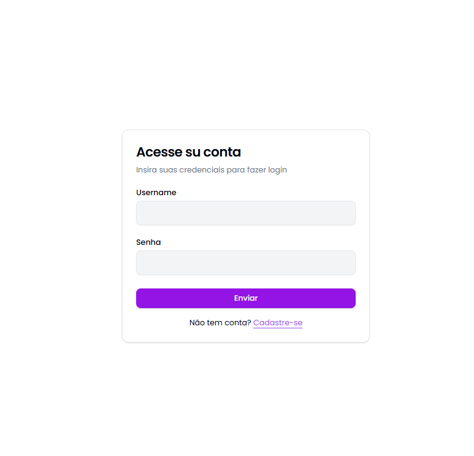
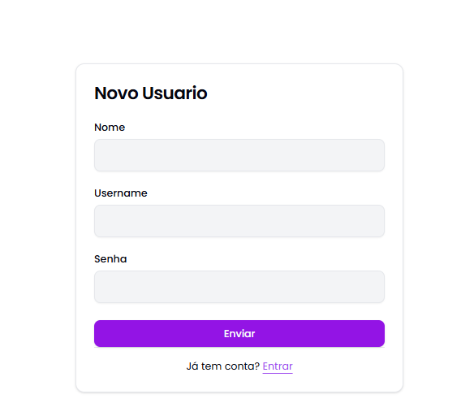
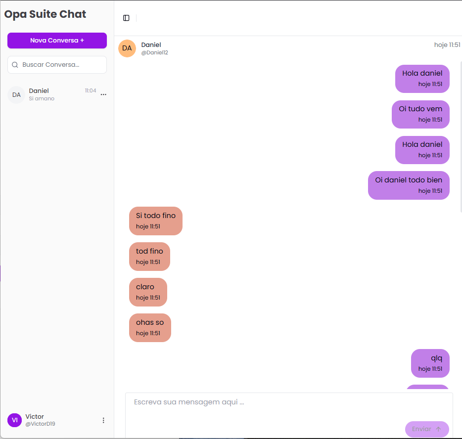
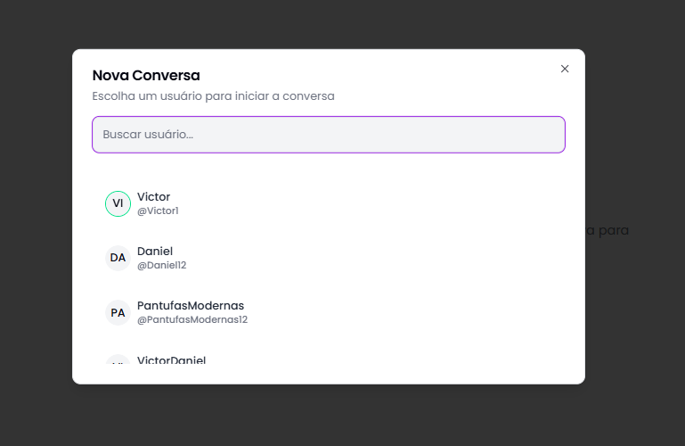
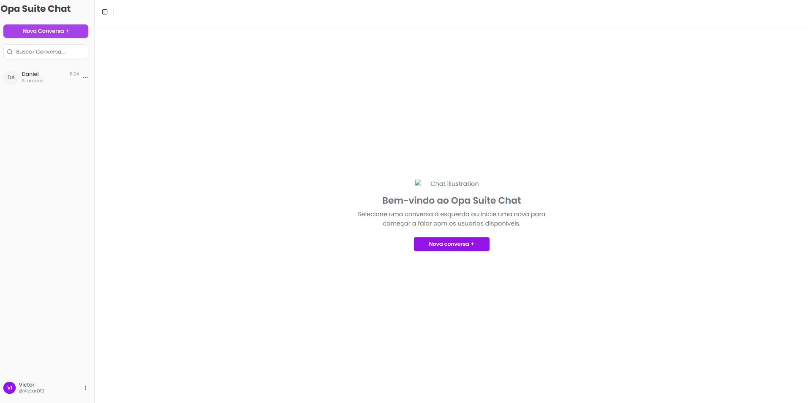

# 🧠 OpaSuite Chat – Realtime Chat App com WebSockets

Plataforma de chat em tempo real com autenticação, gerenciamento de conversas e mensagens, usando WebSocket, Clean Architecture e MongoDB.

---

## 🚀 Tecnologias Utilizadas

- **Frontend:** Next.js 14 (App Router)
- **Backend:** Node.js + Express + Socket.IO
- **Banco:** MongoDB Atlas
- **Auth:** Passport.js
- **Infra:** Docker (opcional)
- **Estilo:** Tailwind CSS + shadcn/ui
- **Realtime:** WebSockets (Socket.IO)
- **Arquitetura:** Clean Architecture

---

## 📦 Instalação (modo local)

### 1. Clone o projeto

```bash
git clone https://github.com/VictorD19/opa-suite-test.git
cd opa-suite-test
```

### 2. Instale dependências

**Backend:**

```bash
cd backend
npm install
```

**Frontend:**

```bash
cd ../opa-suite
npm install
```

### 3. Configure variáveis de ambiente

#### Backend (`backend/.env`):

```env
PORT=
URI_DB_MONGO=
SECRET_KEY_AUTH=
QUANTIDADE_CLUSTER=
URL_FRONT_END=
```

#### Frontend (`opa-suite/.env.local`):

```env
NEXT_PUBLIC_API_URL_BASE=
```

### 4. Inicie o projeto

**Backend:**

```bash
cd backend
npm run dev
```

**Frontend:**

```bash
cd ../opa-suite
npm run dev
```

Acesse em: [http://localhost:3000](http://localhost:3000)

---

**Imagens Do Projeto:**






## ✅ Funcionalidades

- [x] Login e Registro com Passport.js
- [x] Conversas em tempo real (Socket.IO)
- [x] Lista de usuários online/offline
- [x] Lista de Conversas
- [x] Notificações Novas menssagens

---

## 🔐 Variáveis de Ambiente

| Variável | Descrição |
|---------|-----------|
| `NEXT_PUBLIC_API_URL_BASE` | URL da API Backend (usada no Frontend) |
| `URL_FRONT_END` | URL do Frontend (usada no Backend p/ CORS e links) |
| `PORT` | Porta do servidor backend |
| `URI_DB_MONGO` | Conexão MongoDB Atlas |
| `SECRET_KEY_AUTH` | Chave de sessão/autenticação |
| `QUANTIDADE_CLUSTER` | Número de clusters Node.js (usado com `cluster`) |